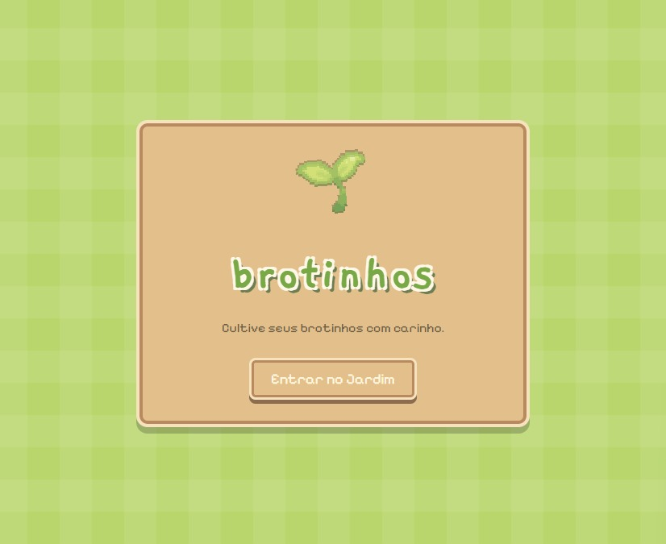
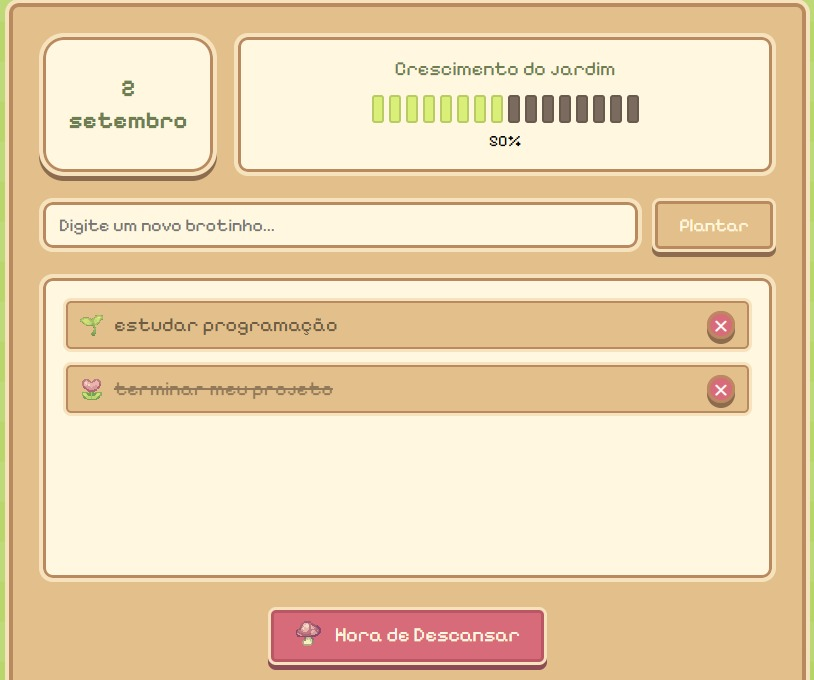
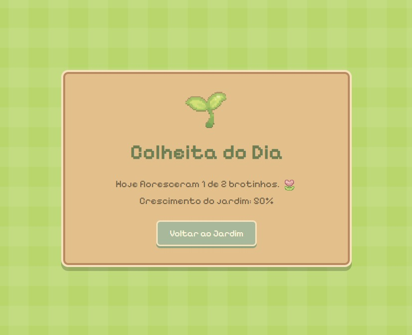

# 🌱 Brotinhos

Brotinhos é uma aplicação de produtividade gamificada com estética cozy e pixel art. A ideia é transformar as tarefas do dia em pequenos brotinhos que você planta, cultiva e vê florescer conforme são concluídas.

## Funcionalidades

• Adicionar novos brotinhos  
• Marcar tarefas como concluídas  
• Excluir brotinhos  
• Acompanhar o crescimento do jardim  
• Salvar tarefas com localStorage  
• Efeitos sonoros interativos  
• Visualizar a colheita e o progresso do dia  
• Aplicação desktop desenvolvida com Electron

## Tecnologias

• HTML  
• CSS  
• JavaScript  
• Node.js  
• Electron  

## Como executar

Instale as dependências:

```bash
npm install
```

Depois execute:

```bash
npm start
```
## Telas do projeto

### Tela inicial



### Jardim



### Colheita


